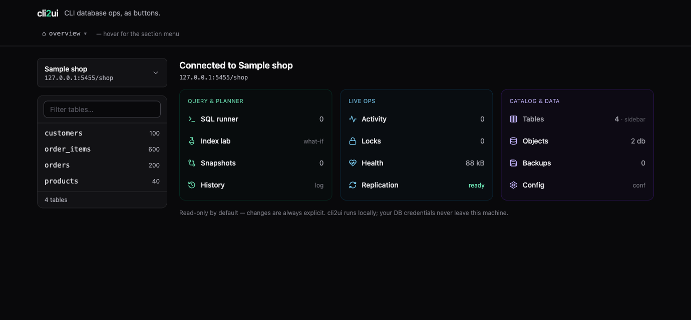
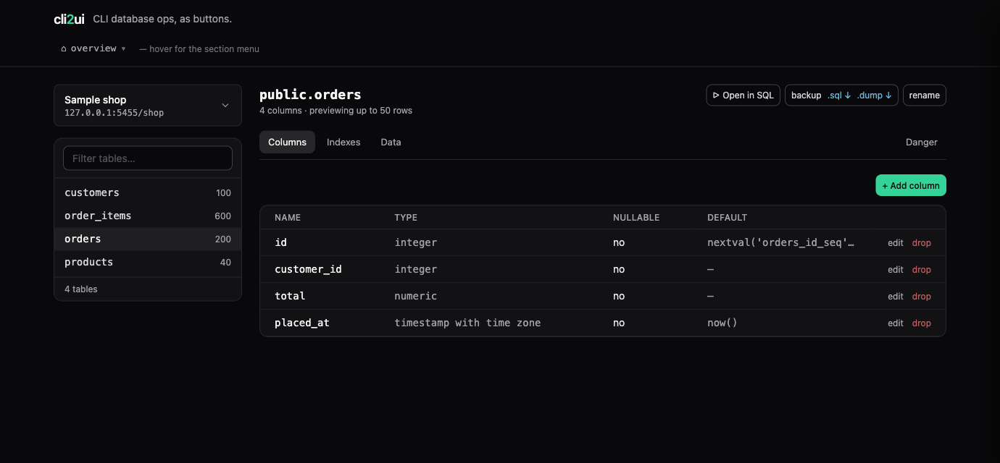
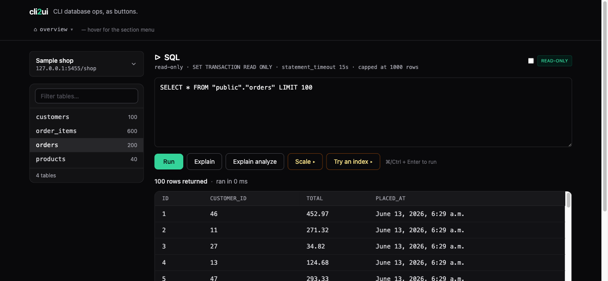

# cli2ui

**CLI database ops, as buttons.** A web UI over the database CLI commands you
keep half-remembering. No AI, no magic — just `psql` operations turned
into clicks, running fully on your machine.

> ⚠️ **Local-only by design.** cli2ui has no authentication and binds to your
> machine. Run it on localhost or inside a trusted network — never expose it to
> the public internet. See [SECURITY.md](SECURITY.md).

```
psql -c "SELECT * FROM pg_stat_activity"   →  one "running queries" button
pg_dump -t users mydb                       →  one "back up this table" button
SELECT pg_terminate_backend(pid)            →  one "kill this process" button
```

Built for **app developers and solo developers** — not DBAs. The pitch is
*"you're looking at your tables 3 minutes after deciding to"* — no install
marathon, no connection-wizard maze, no digging through nested trees.

The UI ships in **English and Japanese** — a header toggle switches between
them, and it auto-detects your browser's language on first visit.

## What it looks like



| Table detail | SQL runner |
| :----------: | :--------: |
|  |  |

## Quick start

```bash
docker compose up
```

Then open <http://localhost:8000>. The connection form is pre-filled to point at
a bundled sample database — just hit **Connect** and you'll see its tables.

To point at your own PostgreSQL, change the form fields (host, port, db, user,
password) and connect.

> **Port 8000 already taken?** It's a common default, so a clash is likely. Just
> remap the *host* side in `docker-compose.yml` — `"8000:8000"` → `"8001:8000"`
> (any free port works) — and open that port instead. Only the number on the
> left changes; the app keeps listening on 8000 *inside* the container.

## Connecting to a database in another container

cli2ui runs in its own container, so "localhost" in the connection form means
*the cli2ui container*, not your machine. Your database almost always lives
somewhere else — another container, another compose project, or a native
install.

> **New to Docker networking?** Don't guess — **[README.NETWORKING.md](README.NETWORKING.md)**
> walks through *why* `localhost` fails and gives a copy-paste fix for every
> setup (native DB, another compose project, a published port), with diagrams
> and a full worked example.

The short version — three ways to reach it (no code changes, just how you fill
the form):

1. **Via the host (simplest).** If the database publishes a port on your machine
   (e.g. `-p 5432:5432`), set the connection **host** to `host.docker.internal`
   and the **port** to the published one. Works the same on macOS, Windows, and
   Linux — the `extra_hosts` entry in `docker-compose.yml` makes the name
   resolve everywhere.

2. **Share a network, connect by container name.** Put both on one external
   network and use the database's container name as the host:

   ```bash
   docker network create cli2ui-net
   # then in BOTH compose files:
   #   networks:
   #     default:
   #       name: cli2ui-net
   #       external: true
   ```

3. **Attach at runtime.** Join the running cli2ui container to the database's
   existing network, then use the DB container name as the host:

   ```bash
   docker network connect <db-network> <cli2ui-app-container>
   ```

## Trying replication locally

The Replication panel reads `pg_stat_replication` / `pg_replication_slots`, so
its **Standbys** table stays empty until a replica is actually attached. To
watch it populate, spin up a throwaway primary + standby pair and point cli2ui
at the primary — see **[README.REPLICATION.md](README.REPLICATION.md)** for a
copy-paste compose file and the exact connection details.

## Status

MVP. `docker compose up` → connect → browse your tables in a DB-client layout
(table list in the sidebar, table detail in the main pane).

- ✅ PostgreSQL: connect + list tables (estimated row counts)
- ✅ Table detail: column definitions (`\d table`) + row preview (`SELECT * … LIMIT`)
- ✅ SQL runner: read-only ad-hoc queries by default (`SET TRANSACTION READ ONLY`
  + `statement_timeout` + 1000-row cap), with an opt-in **write mode** that
  commits — guarded by a whole-database safety snapshot taken before each write
- ✅ EXPLAIN snapshots + diff: save query plans and diff two (before/after an
  index) instead of copy-pasting plans into a scratch file
- ✅ Activity: running queries + connections from `pg_stat_activity`, with
  one-click cancel (`pg_cancel_backend`) / kill (`pg_terminate_backend`)
- ✅ Objects browser: databases (`\l`), schemas (`\dn`), roles (`\du`) — read-only
- ✅ `postgresql.conf` editor: read/edit parameters via `pg_settings` +
  `ALTER SYSTEM SET` + `pg_reload_conf()`, with reload-vs-restart badges
- ✅ Locks: sessions blocked on a lock (`pg_locks` + `pg_blocking_pids`) paired
  with the holder, plus one-click cancel / kill of the blocker
- ✅ Replication: readiness check (`wal_level` / `max_wal_senders`) + WAL position,
  connected standbys (`pg_stat_replication`), and slot create / drop
- ✅ Health: bloat estimate — wasted table space from a stats-only query
  (no scan), next to the dead-rows / vacuum card
- ✅ Command history: SQL run through the runner, logged to the management DB —
  status, row count, timing, and one-click re-open
- ✅ Backup / restore: automatic table snapshots (`pg_dump` custom format) before
  every destructive or structural change (drop / truncate / rename / alter), kept
  under a per-connection size budget (oldest pruned automatically — tune with
  `CLI2UI_MAX_AUTO_BACKUP_BYTES` per snapshot and `CLI2UI_MAX_AUTO_BACKUP_TOTAL_BYTES`
  in total), plus restore of an uploaded dump — streamed to the client tool (not
  buffered in memory) — into a new database or, with a type-gate, an existing one
- ✅ Workspace overview: a bento dashboard summarizing every panel (live counts
  for activity, snapshots, backups, replication readiness…), one click away
- ✅ Internationalization: full English / Japanese UI with a header toggle
  (cookie-persisted, falling back to the browser's `Accept-Language`)
- ⬜ MySQL (the engine layer is ready for it)

## Stack

| Layer        | Choice                | Why |
| :----------- | :-------------------- | :-- |
| Frontend     | htmx + Alpine.js      | Click → swap in HTML. No SPA build needed. |
| Backend      | Django                | Battle-tested psycopg2; management plumbing for free. |
| Management DB| SQLite                | Saved connections + (later) history. Zero extra infra. |
| Infra        | Docker                | Local-only, self-contained. No DB creds ever leave your network. |

## Not doing (on purpose)

- **No AI.** API key management + sending your schema to a third party is a
  non-starter for the people this is for.
- **No SaaS.** The moment we'd hold your DB connection info, the liability and
  encryption story swamps the project. Local-only keeps it honest.

## Security

cli2ui is **local-only by design** — no SaaS, no auth, no outbound calls — so the
threat model is narrow: it runs next to your database on your machine. Even so,
the destructive surface is taken seriously: identifiers are bound with
`psycopg2.sql.Identifier`, the SQL runner defaults to `SET TRANSACTION READ ONLY`,
what-if features always `ROLLBACK`, CSRF is enforced, and `DEBUG` is off by
default. The full threat model and static-analysis results live in
[specs/security-check.md](specs/security-check.md). To report a vulnerability,
see [SECURITY.md](SECURITY.md).

## Local development (without Docker)

```bash
pip install -r requirements.txt
python manage.py migrate
python manage.py runserver
```

You'll need a PostgreSQL to connect to (the `sampledb` service in
`docker-compose.yml` is one option, exposed on `localhost:5433`).

`DEBUG` is **off by default** so error pages don't leak tracebacks, settings, or
SQL. Set `DJANGO_DEBUG=1` while developing if you want Django's rich error pages.

## Contributing

Issues and PRs welcome. See [CONTRIBUTING.md](CONTRIBUTING.md) for how to run the
app, the test suite, and the UI conventions ([STYLE.md](STYLE.md)) new panels
follow.

## License

[MIT](LICENSE) © TABATA Hitoshi
